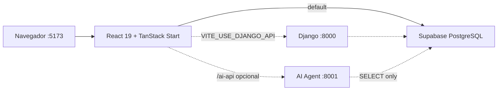

# Cómo arrancar CONTAM (desarrollo)

Guía rápida para levantar el ERP contable peruano en local. Documentación completa en [`docs/ONBOARDING.md`](docs/ONBOARDING.md).

---

## Arquitectura simplificada



| Servicio | ¿Obligatorio? | Puerto |
|----------|---------------|--------|
| Frontend (`npm run dev`) | **Sí** | 5173 |
| Supabase (cloud) | **Sí** | — |
| AI Agent | No | 8001 |
| Django | No | 8000 |

---

## Setup inicial (primera vez)

```powershell
cd D:\CONTAM\peru-fiscal-core8
npm install
copy .env.example .env
# Editar .env con VITE_SUPABASE_URL y VITE_SUPABASE_ANON_KEY
npm run dev
```

Abre [http://localhost:5173](http://localhost:5173).

---

## Orden recomendado (terminales)

### Terminal 1 — Frontend (obligatorio)

```powershell
cd D:\CONTAM\peru-fiscal-core8
npm run dev
```

No requiere Python ni venv (Node.js únicamente).

### Terminal 2 — Agente IA (opcional, chat flotante)

```powershell
cd ai-agent\server
python -m venv venv
.\venv\Scripts\Activate.ps1
pip install -r requirements.txt
copy .env.example .env
python main.py
```

Debe mostrar: `Uvicorn running on http://127.0.0.1:8001`

### Terminal 3 — Django (opcional, solo si `VITE_USE_DJANGO_API=true`)

```powershell
cd backend
python -m venv venv
.
pip install -r requirements.txt
python manage.py runserver
```

Debe mostrar: `Starting development server at http://127.0.0.1:8000/`

---

## ¿Cuándo activar venv?

| Terminal | ¿Venv? | Motivo |
|----------|--------|--------|
| Frontend (`npm run dev`) | **No** | JavaScript / Node |
| Django (`backend/`) | **Sí** | Python |
| IA (`ai-agent/server/`) | **Sí** | Python + FastAPI |

---

## Compilar (producción)
\venv\Scripts\Activate.ps1
```powershell
npm run build
npm run preview   # sirve dist/ localmente
```

---

## Tests y calidad

```powershell
npm test                 # unitarios + integración
npm run test:coverage    # con cobertura
npm run lint             # ESLint
npm run ci               # pipeline completo local
```

Ver [`docs/TESTING.md`](docs/TESTING.md).

---

## Troubleshooting

### El chat IA dice "Failed to fetch"

1. Verifica que el agente IA corre en puerto **8001**
2. Reinicia el frontend (`Ctrl+C` → `npm run dev`) tras cambios en `vite.config.ts`
3. Prueba: [http://localhost:5173/ai-api/health](http://localhost:5173/ai-api/health) → `{"status":"ok"}`

### Error de Supabase / login no funciona

1. Revisa `.env`: `VITE_SUPABASE_URL` y `VITE_SUPABASE_ANON_KEY`
2. Reinicia `npm run dev` después de editar `.env`
3. Verifica que las migraciones estén aplicadas en tu proyecto Supabase

### Feature flag SIRE no cambia comportamiento

1. Confirma `VITE_USE_NEW_SIRE_STRUCTURE=true` en `.env`
2. Reinicia el servidor de desarrollo (Vite lee env al arrancar)
3. Revisa [`docs/adr/003-normalizacion-sire-strangler-fig.md`](docs/adr/003-normalizacion-sire-strangler-fig.md)

### Build falla en CI

1. Ejecuta `npm run ci` localmente
2. Revisa secrets de GitHub: `VITE_SUPABASE_URL`, `VITE_SUPABASE_ANON_KEY`

### Migraciones SQL

Validación local (requiere PostgreSQL):

```bash
bash supabase/tests/test_migrations.sh
```

---

## Documentación

| Enlace | Contenido |
|--------|-----------|
| [docs/ONBOARDING.md](docs/ONBOARDING.md) | Guía completa nuevos desarrolladores |
| [docs/adr/](docs/adr/README.md) | Architecture Decision Records |
| [docs/architecture/diagrams.md](docs/architecture/diagrams.md) | Diagramas C4 |
| [docs/API_INTERNA.md](docs/API_INTERNA.md) | Endpoints y RPCs |
| [docs/STYLE_GUIDE.md](docs/STYLE_GUIDE.md) | Estilo de código |

---

*Actualizado: junio 2026 — Macro-tarea 12*
