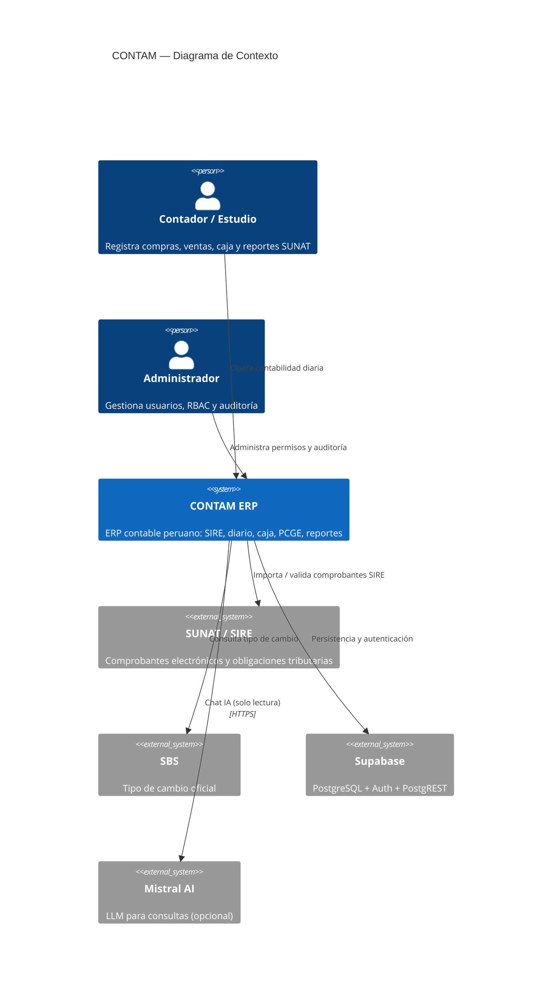
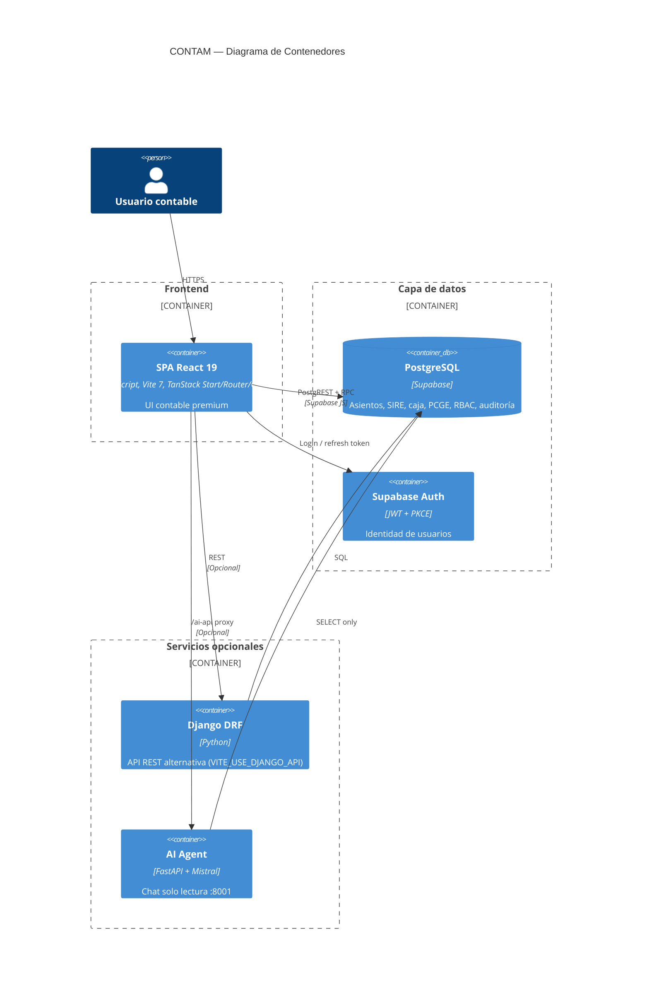
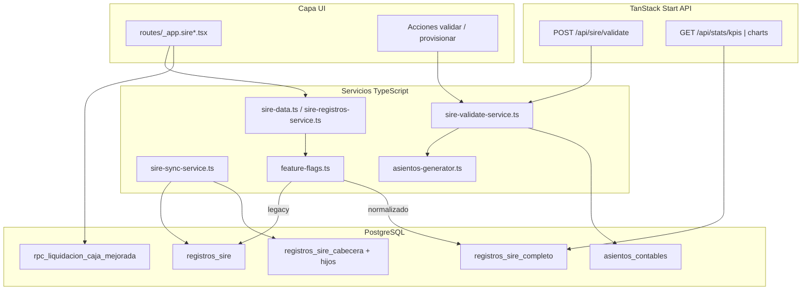
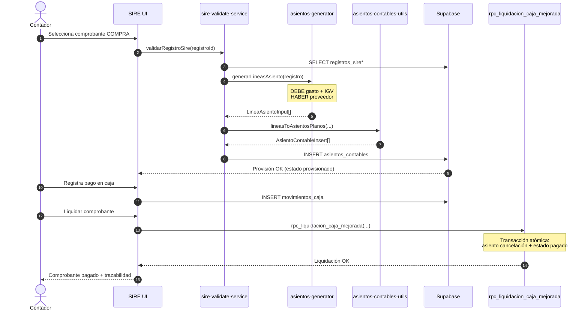

# Diagramas de Arquitectura C4 — CONTAM

Modelo C4 en cuatro niveles usando [Mermaid](https://mermaid.js.org/). Compatible con GitHub, VS Code (extensión Mermaid Preview) y Cursor.

---

## Nivel 1 — Contexto del Sistema

Quién usa CONTAM y con qué sistemas externos interactúa.

---

## Nivel 2 — Contenedores

Aplicaciones y servicios desplegables.

---

## Nivel 3 — Componentes (Módulo SIRE)

Componentes principales del dominio SIRE dentro del frontend y BD.

---

## Nivel 4 — Código (Flujo Compra → Provisión → Pago)

Secuencia detallada del flujo contable crítico.

---

## Stack tecnológico (referencia)

| Capa | Tecnología |
|------|------------|
| UI | React 19, TypeScript strict, Tailwind 4, shadcn/ui |
| Routing / SSR | TanStack Start + TanStack Router |
| Estado servidor | TanStack Query (`query-keys-contables.ts`) |
| BD | PostgreSQL 15+ (Supabase) |
| Auth | Supabase Auth + RLS + RBAC (027) |
| Tests | Vitest, Playwright, MSW |
| CI | GitHub Actions (`.github/workflows/ci.yml`) |
| Deploy | Cloudflare Pages |

---

## Documentos relacionados

- [ADRs](../adr/README.md)
- [API interna](../API_INTERNA.md)
- [Onboarding](../ONBOARDING.md)
- [Testing](../TESTING.md)
